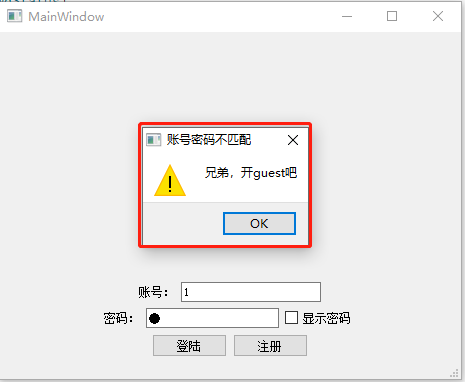
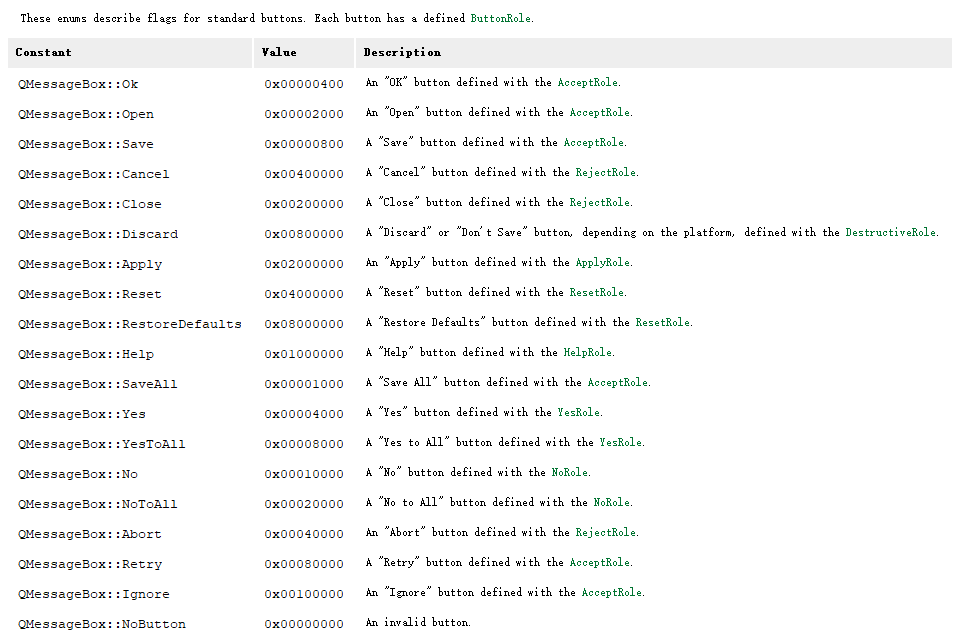

# Qt_learing

## 控件学习

### 1、学习QLineEdit

QLineEdit部分内置信号与槽

signal：

```C++
// 输入框中text变化时，发送该信号。text表示当前输入框的内容
void  textChanged(const QString &text); 
void  textEdited(const QString &text);

```

slot：

```C++

void clear();						// 清空该输入框
void copy() const;					// 拷贝当前输入框的内容
void cut();							// 剪切
void paste();						// 粘贴
void redo();						// 重复上一次操作（取决于一个开关）
void selectAll();					// 选择输入框的所有内容
void setText(const QString &);		// 给输入框设置text
void undo();						// 撤销当前输入

```


### 2、布局管理器

常用的布局管理器有三种，水平、垂直和格子管理器，分别功能为：

水平：控件在水平方向保持一致。

垂直：控件在垂直方向保持一致。

格子：在一个网格下，控制嵌入其中。


其中水平和垂直管理器均较简单，直接添加即可。

网格管理器，需要制定填入网格的坐标；一般以0，0为起点，row（行），col（列）作为数字填入即可

简单代码如下：

```C++
    // 创建垂水平布局器， 账号和密码
    QHBoxLayout *account = new QHBoxLayout();
    account->addWidget(ui->accountLable);
    account->addWidget(ui->account);

    QHBoxLayout *passwd = new QHBoxLayout();
    passwd->addWidget(ui->passwdLable);
    passwd->addWidget(ui->password);

    // 创建一个垂直布局器，账号和密码
    QVBoxLayout *qhbox1 = new QVBoxLayout();
    // 将登陆和注册按钮放在该布局器中
    qhbox1->addLayout(account);
    qhbox1->addLayout(passwd);

    // 创建水平布局器，包含登陆和注册
    QVBoxLayout *button = new QVBoxLayout();
    button->addWidget(ui->logIn);
    button->addWidget(ui->registers);

    out << "debug";
    QGridLayout *grid = new QGridLayout(this->centralWidget());
    grid->addWidget(ui->welcome,0 ,0 );
    grid->addLayout(qhbox1, 1, 0);
    grid->addLayout(button, 2, 0);

    setLayout(grid);
```


上述代码用纯代码的方式实现了一个登陆界面（很拙劣的一个），在一般的界面设计中，还是用ui来调节会方便很多

### 3、消息盒子

Qt中提供了一些简单消息盒子，例如输入密码错误后，出现一个简单的界面来提示用户；




```C++

void about(QWidget *parent, const QString &title, const QString &text);

void aboutQt(QWidget *parent, const QString &title = QString());

QMessageBox::StandardButton critical(QWidget *parent, const QString &title, const QString &text, QMessageBox::StandardButtons buttons, QMessageBox::StandardButton defaultButton = NoButton);

int critical(QWidget *parent, const QString &title, const QString &text, QMessageBox::StandardButton button0, QMessageBox::StandardButton button1);

QMessageBox::StandardButton information(QWidget *parent, const QString &title, const QString &text, QMessageBox::StandardButtons buttons, QMessageBox::StandardButton defaultButton = NoButton);

QMessageBox::StandardButton information(QWidget *parent, const QString &title, const QString &text, QMessageBox::StandardButton button0, QMessageBox::StandardButton button1 = NoButton);

QMessageBox::StandardButton question(QWidget *parent, const QString &title, const QString &text, QMessageBox::StandardButtons buttons = ..., QMessageBox::StandardButton defaultButton = NoButton);

int question(QWidget *parent, const QString &title, const QString &text, QMessageBox::StandardButton button0, QMessageBox::StandardButton button1);

QMessageBox::StandardButton warning(QWidget *parent, const QString &title, const QString &text, QMessageBox::StandardButtons buttons, QMessageBox::StandardButton defaultButton = NoButton);

int warning(QWidget *parent, const QString &title, const QString &text, QMessageBox::StandardButton button0, QMessageBox::StandardButton button1);

```

根据Qt官方帮助文档，可以简单分为about，critical，information，question，warning这几种；分别对应这不同消息盒子；

以warning为例，来解释各个参数含义：

```C++
QMessageBox::StandardButton warning(QWidget *parent, const QString &title, const QString &text, QMessageBox::StandardButtons buttons, QMessageBox::StandardButton defaultButton = NoButton);
```

首先，这是个static方法，可以直接通过类名调用；

parent：表示父类。（在Qt中，有父类和子类的概念，当父类析构时，会把该父类的子类全部析构；同时也是窗口显示问题，当选定到某个窗口为父类，则子类会在该父类之上显示）

title：消息盒子的标题。

text：消息盒子的文本内容。

buttons：消息盒子显示的显示的按钮，这里可以提供多个标准按钮在消息盒子上：



defaultButton：消息盒子打开时，默认选中的按钮。

返回值StandardButton：当消息盒子存在多个按钮时，可以通过返回值来判断用户选择的是哪个按钮（以上图的枚举来判断）

例子：

```C++
void MainWindow::Login()
{
    QString account = ui->account->text();
    QString passwd = ui->password->text();

    // 认证过程
    if (account == "shm" && passwd == "123456") {
        out << "登陆成功";
        QMessageBox::information(this, "登陆成功", "欢迎使用", QMessageBox::Open | QMessageBox::Yes, QMessageBox::Yes);
    } else {
        QMessageBox::warning(this, "账号密码不匹配", "兄弟，开guest吧");
    }
}

```


### 4、对话框

对话框，可以分为Qt内置的和自定义的两种；

Qt内置的对话框有：颜色对话框、字体对话框和文件对话框等；

之前使用的比较多的是文件对话框。

颜色对话框：

```C++

Static QColor getColor(const QColor &initial = Qt::white, QWidget *parent = nullptr, const QString &title = QString(), QColorDialog::ColorDialogOptions options = ...)

```

静态函数，可以直接通过类型调用。

initial：表示打开对话框默认选择的颜色。

parent：父类。

title：标题。

返回值：返回用户选择的颜色。

**如果判断用户是否选择OK还是cancle**

根据返回值QColor中的一个方法：

```C+=
bool QColor::isValid() const
```

如果用户点击了OK，那么该接口返回true，反之返回false；


字体对话框

```C++
QFont getFont(bool *ok, QWidget *parent = nullptr)
```

ok：表示用户是否选择字体；

返回值：用户选择的字体，Qfont。


文件对话框

```C++

QString getOpenFileName(QWidget *parent = nullptr, const QString &caption = QString(), const QString &dir = QString(), const QString &filter = QString(), QString *selectedFilter = nullptr, QFileDialog::Options options = ...)

```

该函数用在需要用户打开文件时，弹出文件对话框，来选择文件使用。

parent：父类。

caption：类似于标题。

dir：打开的默认路径。

filter：过滤的文件，只有符合该参数的文件类型才会被显示，如果想要多个文件类型显示，可以用;;来显示

```C++
  "Images (*.png *.xpm *.jpg);;Text files (*.txt);;XML files (*.xml)"
```

该filter表示只显示images和xml文件，分别对应.png,xpm,jpg和xml格式。

返回值为用户选择的文件的路径，若没有选择，则为null。

### 5、文件操作
Qt中的文件操作有三种：
QFile、QDir和QFileInfo
QFile，进行文件读和写：
``` c++
void MainWindow::OpenFile()
{
    filePath = QFileDialog::getOpenFileName(this, tr("选择打开的文件"), ".", "text(*.txt) markdown(*.md)");
    QFile file(filePath);
    if (!file.open(QIODevice::ReadOnly)) {
        QMessageBox::warning(this, "警告","打开文件失败");
        return;
    }
    QByteArray data = file.readAll();
    ui->textEdit->setText(data);
    ui->textBrowser->setText(data);
    file.close();
}

void MainWindow::SaveFile()
{
    QString data = ui->textEdit->toPlainText();
    QFile file(filePath);
    if (file.open(QIODevice::ReadWrite | QIODevice::Truncate)) {
        QMessageBox::warning(this, "警告","打开文件失败");
        return;
    }
    file.write(data.toUtf8());
    file.close();
}
```


### 数据库操作

本次学习的数据库操作是基于sqlite3学习；

#### 1）学习数据库编译

从官网中下载到源代码，源代码非常简单，只有几个文件，可以用gcc直接编译；


其中，shell.c是我们的执行终端，后面的是核心c文件，其中sqlite3.c有8m左右大小；

在cmd或者shell上执行

```shell
gcc -o sqlite3 shell.c sqlite3.c -lpthread
```

可以编译出sqlite3的可执行文件，这个就是数据库的可执行文件


#### 2）学习数据库的简单知识

数据库中存储数据是以表格的形式存储的，例如：

| 编号 | 姓名 | 性别 | 年龄 | 地址       | 电话  |
| ---- | ---- | ---- | ---- | ---------- | ----- |
| 1    | 张三 | 男   | 30   | 四川省成都 | 10000 |
|      |      |      |      |            |       |
|      |      |      |      |            |       |

编号，姓名，性别，年龄，电话，这些都称为表格的字段

###### 字段的数据类型

| 类型    | 范围            | 说明                  |
| ------- | --------------- | --------------------- |
| int     | -2^32 ~ 2^32 -1 | 整型                  |
| float   |                 | 浮点                  |
| real    |                 | 浮点                  |
| char    | 8000            | 定长的unicode字符类型 |
| varchar | 8000            | 变长的unicode字符类型 |
| test    | 2G·             | 变长unicode文本类型   |


#### 3）SQL语句

SQL语句一般有（语句一般不区分大小写）

创建表格

```sqlite
create table 表明 (字段名 字段数据类型， 字段名 字段数据类型, ...) # 例如：
create table person (number int, name char[32], sex varchar[8], address text, phone char[11]);
```

插入数据

```sqlite
insert into 表名 values(值1， 值2); # 规定字段类型char, varchar, text类型，值需要用双引号或单引号
insert into 表名(字段1， 字段2) values（值1， 值2）;# 第二个插入方式可以选择某几个数据写入，其他字段不写入

# 例如：
insert into person values(1, "张三", "男", "四川省成都市", "1000000000");
insert into person(number, name, sex) values(2, "李四", "不男不女");

```

效果如下：


查询数据

```sql
select [字段1，字段2， ...] from 表名 # 查询所有的字段的话，可以用*代替
# 条件查询
select * from 表名 where 条件;
# 条件可以有很多：
# number==1, number>1, 等等
# number<10 and name=="张三"
# sex=="男" or number < 2
```


更新数据

```sql
update 表名 set 字段名=数值名 where 条件 # 更新数据

```


删除数据

```sql
delete from 表名 where 条件; # 删除表格的数据，表格本身还在;
```

删除表格

```sql
drop table 表名 # 删除整个表格
```

修改表格

```sql
alter table 表名 add column 字段名称 字段类型 # 为表名添加一个字段

```

其他命令：

```sql
.table # 查看该数据库的所有表格
pragma table_info(表名) #查询表的结构信息
```


#### 4） SQL的事务机制

把更新数据，插入数据，删除数据等操作，可以创建一个事务，在这个事务中处理无误后，一次性提交到数据库。

实际上，提交到数据库就是在写文件，写文件是比较慢的，事务相当于就是先写入到内存，然后再写入到文件；

在没有提交得到情况下，可以回滚。

```sql
begin # 开启事务
commit # 提交事务
rollback # 回滚
```


#### 5）数据库约束

主键(primary key)：即在该表格内，这个字段的值不和其他数据重复，即是唯一的；

int类型的主键，可以设置为autoincrement 

NOT NULL  值不能为空

unique值唯一

default 设置字段默认值

if not exists ：判断表格是否存在，如果不存在，则创建表格

```sql
create table student(id integer primary key autoincrement, # 主键，自动增长
					name varchar[32], NOT NULL, # 姓名，不能为空
					sex varchar[8],
					phone text UNIQUE, # 电话必须设置为唯一的
					regtime TimeStamp NOT NULL default (datatime('now', 'local'))
                    # 时间不能为空，默认用当前时间来插入
					);
insert into student(name, sex, phone) values('edword', 'man', '10010');		
select * from student;
```


第一个数值会自动增长，最后时间会自动生成并插入


#### 6）用api操作数据库

首先需要把数据库的源代码拷贝到项目中来:sqlite3.c sqlite3.h

然后就可以使用sqlite3提供的接口：

```c
int sqlite3_open(         // 打开数据库接口
  const char *filename,   /* Database filename (UTF-8) */
  sqlite3 **ppDb          /* OUT: SQLite db handle */
);

int sqlite3_close(sqlite3*); // 关闭数据库

int sqlite3_exec(		// 执行sql语句
  sqlite3*,                                  /* An open database */
  const char *sql,                           /* SQL to be evaluated */
  int (*callback)(void*,int,char**,char**),  /* Callback function */
  void *,                                    /* 1st argument to callback */
  char **errmsg                              /* Error msg written here */
);
// 针对exec执行语句，注意以下几点：
// 1.callback回调函数，可以通过该函数获取查询数据库的值；
// 第一个cahr**是拿到的数据库的值，值通过数组的方式存在一个二维指针内；
// 第二个char**是列的名称；
// 2.void*是回调函数的第一个参数，可以通过该参数将内容带出去
// 3. errmsg 保存错误信息，需要通过sqlite3_free释放内存
// 4. int (*callback)(void* arg, int col, char** values, char**names), 参数解析如下：
// void* arg - sqlite3_exec的第四个参数
// int col - 查询到的数据的列
// char** values -- 一行数据的所有值
// char** names -- 一列数据对应的字段名
// 返回值 -- 如果需要全部查询就返回0， 如果需要终止返回非0

int sqlite3_get_table(
  sqlite3 *db,          /* An open database */
  const char *zSql,     /* SQL to be evaluated */
  char ***pazResult,    /* Results of the query */
  int *pnRow,           /* Number of result rows written here */
  int *pnColumn,        /* Number of result columns written here */
  char **pzErrmsg       /* Error msg written here */
);


```


#### 7） QT的数据操作

QSqlDatabase（数据库操作）、QSqlDriver（数据库驱动）、QSqlError（错误信息）、QSqlQuery（执行SQL语句）、QSqlRecord（数据记录）、QSqlTableModel（数据库表格模型）

